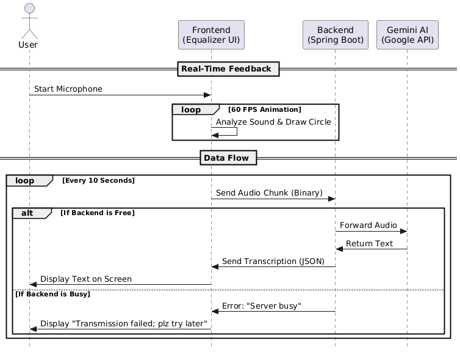
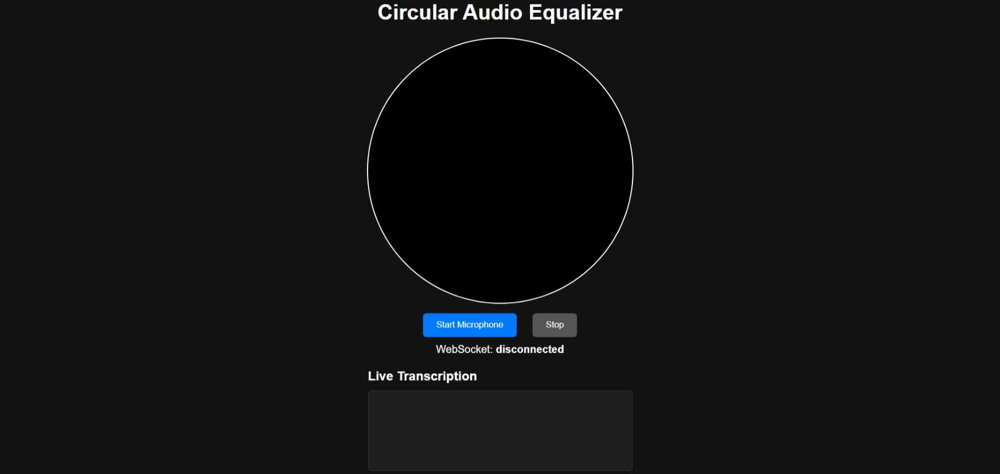
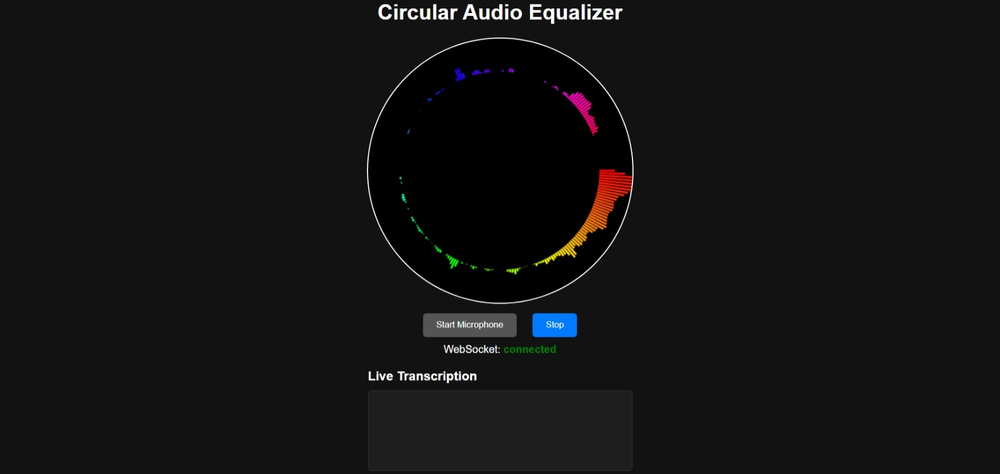

# Audio Equalizer and Real-Time Transcription Project

This project implements a fullstack application based on the Pre Interview Assignment, featuring a circular audio equalizer UI and real-time streaming transcription service.

## Features

- **Circular Audio Equalizer**: Visualizes audio frequency data in a circular format using Web Audio API and Canvas.
- **Real-Time Transcription**: Streams audio chunks to Gemini API for immediate transcription via WebSockets.
- **Responsive UI**: Clean, modern interface with live transcription display.

## Screenshots
### UML Diagram


### Circular Audio Equalizer


### Live Transcription Interface


## Setup Instructions

### Prerequisites
- Java 17+
- Maven
- Node.js (for frontend development)
- Google Gemini API key

### Frontend
1. Navigate to `frontend/` directory.
2. Open `index.html` in a browser that supports MediaStream API (e.g., Chrome, Firefox).
3. Allow microphone access when prompted.

### Backend
1. Set environment variable: `export GEMINI_API_KEY=your_api_key_here`
2. Navigate to `backend/` directory.
3. Run `mvn spring-boot:run`.
4. Backend will start on port 9090.

### Running the Application
1. Start the backend.
2. Open the frontend in a browser.
3. Click "Start Microphone" to begin audio visualization and transcription.

## API Documentation

### WebSocket Endpoint
- URL: `ws://localhost:9090/transcription`
- Sends audio chunks and receives transcription results in real-time.

## Project Structure

```
AudioEqualizerTranscription/
├── backend/                 # Spring Boot application
│   ├── src/main/java/com/example/audiotranscription/
│   │   ├── config/          # WebSocket and CORS configs
│   │   ├── service/         # Transcription service
│   │   └── controller/      # Web controllers
│   └── pom.xml
├── frontend/                # HTML/CSS/JS frontend
│   ├── index.html
│   ├── script.js
│   └── styles.css
├── docs/                    # Documentation
│   └── website_enhancements.md
├── screenshots/             # Screenshots for README
├── demo/                    # Demo video
└── README.md
```

## Technologies Used

- **Frontend**: HTML5 Canvas, Web Audio API, WebSockets, JavaScript
- **Backend**: Spring Boot, WebFlux, WebSockets, Google Gemini API
- **Build Tools**: Maven

## Contributing

1. Fork the repository
2. Create a feature branch
3. Commit your changes
4. Push to the branch
5. Create a Pull Request

## License

This project is for educational purposes as part of the Pre Interview Assignment.
"# Circular-Audio-Equalizer" 
👤 Author
Gunje Sundar Kumar Computer Science & Engineering Student
